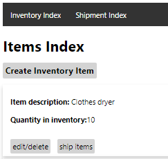
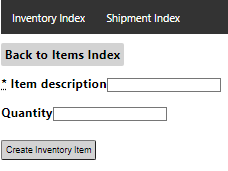
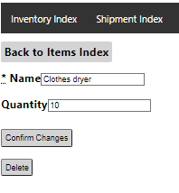
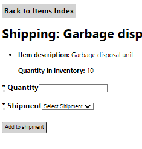
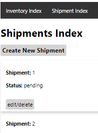
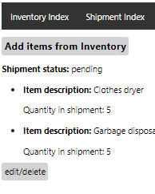
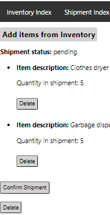

# **Inventory Manager**

This is an application where a user is able to create and view inventory item. All inventory items created will appear on the homepage(Inventory Index)

Items can be added to pending shipment and inventory will adjust accordingly. Shipment status can be changed to shipped. You will not be able to delete items from shipments that are shipped.

This is an application built with the ruby on rails template generated from replit in order to ensure stability. The code is mostly Ruby with some html CSS


## **Table of Contents**

---

* [Deployment](#Deployment)
* [Application-step-by-step](#Application-step-by-step)
* [Tests](#Tests)
* [Stack](#Stack)


## **Deployment**

---

The application is intended to run on replit.
If you wish to run the application locally the following cli commands need to be executed
```bash
  bundle: install
  rails db:migrate
  rails db:seed (optional)
  rails s
```

The server will run on port 3000 to access it on browser go to http://localhost:3000/

In the event that gems don't install correctly, try deleting the gemfile.lock and running `bundle: install` again


## **Application-step-by-step**

---

### **Homepage**

The homepage is the Items Index





### **Create Inventory Item**




Item Description: must be unique and not left blank

Item Quantity: must be an integer greater or equal to 0

### **Edit Inventory Item**



Changing quantity or name

Items can be deleted only if they are not in a shipment or have not been shipped


### **Ship Inventory Item**



Cannot ship more than what is available in inventory

Quantity must be an integer greater than 0

Only pending or unshipped shipment will appear as a selection

### **Shipment Index**



### **Shipment Show Page**



### **Shipment Edit Page**



Able to delete items from shipments and return quantity to inventory only status is pending

Able to delete the entire shipment and return quantities to inventories only status is pending

## **Tests**

---

### **Model Tests**


## **Stack**

---

- Ruby on rails framework

- SQlite

- Ruby

- Rails

- html

- CSS
