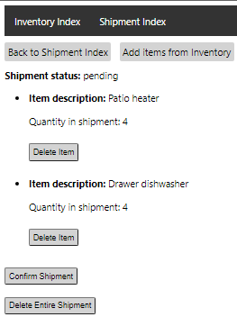

# **Inventory Manager**

This is an application where a user is able to create and view inventory item. All inventory items created will appear on the homepage(Inventory Index)

Items can be added to pending shipment and inventory will adjust accordingly. Shipment status can be changed to shipped. You will not be able to delete items from shipments that are shipped.

This is an application built with the ruby on rails template generated from replit in order to ensure stability. The code is mostly Ruby with some html and CSS

## **Table of Contents**

* [Stack](#Stack)
* [Deployment](#Deployment)
* [Database Schema](#Database_Schema)
* [Application Breakdown](#Application_Breakdown)
* [Tests](#Tests)

## **Stack**

- Ruby on rails framework

- Ruby

- SQlite

- Html

- CSS

## **Deployment**

The application is intended to run on replit.

https://replit.com/@gch90/inventorymanager#app/controllers/application_controller.rb

If you wish to run the application locally the following cli commands need to be executed
```bash
  bundle: install
  rails db:migrate
  rails db:seed (optional)
  rails s
```

The server will run on port 3000 to access it on browser go to http://localhost:3000/


## **Database_Schema**


## **Application_Breakdown**


### **Homepage**

The homepage is the Items Index


### **Create Inventory Item**


Item Description: must be unique and not left blank

Item Quantity: must be an integer greater or equal to 0

### **Edit Inventory Item**


Changing quantity or name

Items can be deleted only if they are not in a shipment

If shipment is shipped item cannot be deleted


### **Ship Inventory Item**


Cannot ship more than what is available in inventory

Quantity must be an integer greater than 0

Only pending or unshipped shipment will appear as a selection

### **Shipment Index**


When shipment is confirmed ability to delete shipment is removed

Creates shipments with a default status of pending

### **Shipment Show Page**


When shipment is confirmed ability to edit shipment is removed

### **Shipment Edit Page**




Able to delete items from shipments and return quantity to inventory only if shipment status is pending

Able to delete the entire shipment and return quantities to inventories only if shipment status is pending

## **Tests**

Model tests for items and shipped_items

Controller tests for items, shiments and shipped_items

To run all tests, run the following command in the cli
```bash
  rails test
```
To run only the model tests, run the following command in the cli
```bash
   rails test test/models
```
To run only the controller tests, run the following command in the cli
```bash
   rails test test/controllers
```
